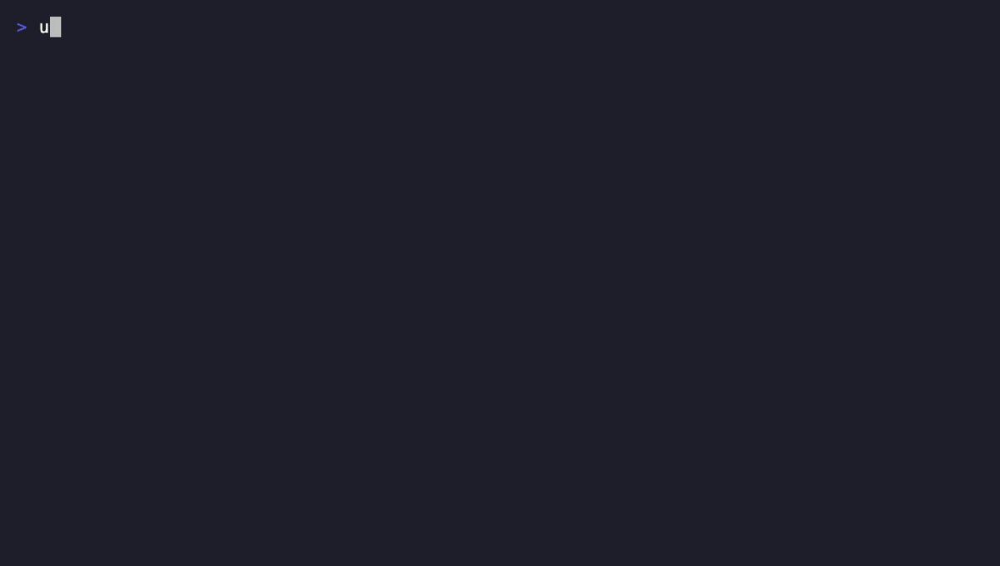

# langgraph-spec-toolkit

[](https://github.com/mkrishna-gs/langgraph-spec-toolkit/actions/workflows/ci.yml)
[](LICENSE)
[](pyproject.toml)
[](#project-status)

**An MCP server + Claude skill for building [LangGraph](https://github.com/langchain-ai/langgraph) projects by editing a structured YAML spec — not by regenerating Python from scratch on every turn.**

```
edit spec.yaml (via MCP tools)  →  validate_graph  →  render_python  →  graph.py
```

Graph topology — nodes, edges, state schema, checkpointer — is data, not
prose. An LLM agent should be able to add a node or rewire an edge with one
small, targeted tool call, not re-emit 150 lines of Python and hope nothing
upstream broke. `spec.yaml` is the source of truth; `graph.py` is a
deterministic, regenerable build artifact you never hand-edit.

## Quick look



Four tool calls, zero hand-written Python for the graph wiring itself.
(Regenerate with `vhs .github/assets/demo.tape` — see that file for a
`vhs` 0.12.0 bug you may need to work around.)

<details>
<summary>Text transcript, if the GIF doesn't load</summary>

```
$ uv run python .github/assets/demo.py
1) init_project - scaffold spec.yaml, nodes.py

2) add_node / add_edge - small, targeted edits

3) validate_graph - catch problems before any code is emitted

   ok=True  issues=0

4) render_python - deterministic codegen, no LLM involved

   wrote demo_graph/graph.py

$ cat demo_graph/graph.py
"""Auto-generated by langgraph-spec-toolkit — DO NOT EDIT BY HAND.

Regenerate with the `render_python` MCP tool after changing spec.yaml.
Source spec: demo_graph
"""

from langgraph.graph import StateGraph, START, END
from typing import TypedDict
from . import nodes


class GraphState(TypedDict):
    pass


def build_graph():
    workflow = StateGraph(GraphState)

    workflow.add_node('greet', nodes.greet)
    workflow.add_node('respond', nodes.respond)

    workflow.add_edge(START, 'greet')
    workflow.add_edge('greet', 'respond')
    workflow.add_edge('respond', END)

    return workflow.compile()
```

</details>

## Table of contents

- [Quick look](#quick-look)
- [Why](#why)
- [Prior art](#prior-art)
- [Project status](#project-status)
- [Installation](#installation)
- [Usage](#usage)
- [The spec format](#the-spec-format)
- [MCP tools](#mcp-tools)
- [Validation](#validation)
- [Example](#example)
- [Benchmarks](#benchmarks)
- [Development](#development)
- [Releasing](#releasing)
- [Contributing](#contributing)
- [License](#license)

## Why

- **Token cost.** A full-file rewrite scales with graph size on every edit;
  a spec edit doesn't. Measured with [`benchmarks/token_usage.py`](benchmarks/token_usage.py)
  (`uv run python benchmarks/token_usage.py`, no network access or vendor
  SDK required — see the script for what "token" means here):

  | Nodes in graph | Full `graph.py` regen (tokens) | One spec edit (tokens) | Ratio |
  |---:|---:|---:|---:|
  | 3 | 168 | 21 | 8.0x |
  | 5 | 204 | 21 | 9.7x |
  | 10 | 294 | 21 | 14.0x |
  | 25 | 564 | 21 | 26.9x |
  | 50 | 1014 | 21 | 48.3x |
  | 100 | 1914 | 21 | 91.1x |

  A single spec edit stays flat regardless of graph size; a full-file
  regen grows linearly with it. Token counts use a small offline
  approximate tokenizer, not a specific vendor's real BPE tokenizer, so
  the numbers are illustrative rather than exact — the shape of the curve
  (flat vs. linear) is the actual claim, and holds under any reasonable
  way of counting.
- **Error rate.** Free-form Python regeneration risks silently dropping an
  edge, mistyping a state key, or producing an unreachable node. A
  structured spec can be validated *before* any code is emitted.
- **Diffability.** `spec.yaml` changes are small, reviewable diffs. A
  regenerated file's diff is often the whole file.

## Prior art

[`langgraph-codegen`](https://pypi.org/project/langgraph-codegen/) already
does DSL → Python codegen for LangGraph and is worth a look. It ships as a
library/CLI, without an MCP server, a validation pass, diagramming, or a
skill layer for an LLM to drive it interactively — that's the gap this
project fills. We use our own spec format rather than adopting its DSL.

## Project status

**v0.1 (current, `0.1.0`)** — first cut, functional end-to-end on a single
flat graph:

- Spec schema: state fields, nodes, edges (simple + conditional), checkpointer.
- MCP tools: `init_project`, `add_node`, `add_edge`, `remove_node`,
  `remove_edge`, `set_state_schema`, `get_spec`, `validate_graph`,
  `render_python`.
- Validation: unreachable nodes, missing path to `END`, dangling
  conditions/edges, duplicate/typo'd ids, unsafe identifiers in
  `function`/`condition`/state field names/reducers.
- Deterministic Jinja2 codegen — no LLM in the render path.
- `pytest` suite covering the spec model, validator, renderer, and every
  MCP tool.

Out of scope for v0.1: diagramming, subgraphs, multi-file projects, and a
`langgraph-codegen`-style DSL importer. This is a young project; expect the
spec schema and tool signatures to evolve before 1.0.

## Installation

Requires Python 3.11+ and [uv](https://docs.astral.sh/uv/) (which provides
`uvx`).

**Via `uvx`** (recommended — no clone, no local install; `uvx` fetches
[`langgraph-spec-toolkit`](https://pypi.org/project/langgraph-spec-toolkit/)
from PyPI and runs it on demand):

```json
{
  "mcpServers": {
    "langgraph-spec-toolkit": {
      "command": "uvx",
      "args": ["langgraph-spec-toolkit"]
    }
  }
}
```

**From source** (if you're developing on the toolkit itself):

```bash
git clone <this-repo>
cd langgraph-spec-toolkit
uv sync
```

```json
{
  "mcpServers": {
    "langgraph-spec-toolkit": {
      "command": "uv",
      "args": ["run", "--directory", "/path/to/langgraph-spec-toolkit", "python", "-m", "mcp_server.server"]
    }
  }
}
```

Runtime dependencies are intentionally minimal: `mcp`, `jinja2`, `pyyaml`.
`render_python`'s *output* imports `langgraph` (and `langchain-core`, if
your state uses message types) — those are dependencies of the project
you're generating, not of this toolkit.

## Usage

Either config above starts the MCP server (it speaks MCP over stdio) the
moment your client connects — there's no separate "run the server" step to
do by hand. If you want to smoke-test it directly:

```bash
uv run python -m mcp_server.server   # from a source checkout
uvx langgraph-spec-toolkit           # from PyPI
```

Then drive it through the tools below — or point Claude at `skill/SKILL.md`
and let it drive itself. A typical session:

```
init_project(project_dir="my_graph", name="my_graph")
add_node(project_dir="my_graph", id="start", config={"function": "start"})
add_node(project_dir="my_graph", id="respond", config={"function": "respond"})
add_edge(project_dir="my_graph", from_="start", to="respond")
add_edge(project_dir="my_graph", from_="respond", to="END")
validate_graph(project_dir="my_graph")   # -> ok: true
render_python(project_dir="my_graph")    # -> writes my_graph/graph.py
```

...then write `start`/`respond` in `my_graph/nodes.py` and you have a
runnable graph.

## The spec format

`spec.yaml`:

```yaml
name: simple_chatbot
entry_point: greet
state:
  - name: messages
    type: list[BaseMessage]
    reducer: add_messages
    default: []
nodes:
  - id: greet
    type: python
    config:
      function: greet          # callable in nodes.py; defaults to the node id
  - id: chatbot
    type: python
    config:
      function: chatbot
  - id: tools
    type: python
    config:
      function: call_tools
edges:
  - from: greet
    to: chatbot
  - from: chatbot
    condition: route_after_chatbot   # router fn in nodes.py
    paths:
      continue: tools
      end: END
  - from: tools
    to: chatbot
checkpointer:
  type: none                    # none | memory | sqlite | postgres
```

Node and router **bodies are not generated** — `render_python` only owns
topology, state, and wiring. You write the callables in the project's
`nodes.py`, named to match `config.function` / `condition`. This keeps
codegen deterministic: the same spec always renders to the same Python, and
business logic never gets silently rewritten on a regen.

`type` on a state field is a raw Python type expression. A handful of
common symbols — `BaseMessage`, `AnyMessage`, `HumanMessage`, `AIMessage`,
`SystemMessage`, `ToolMessage`, `ChatMessage`, plus `Any` / `Optional` /
`Sequence` / `Union` / `Literal` from `typing` — are recognized by name and
auto-imported in the rendered file. `reducer` similarly recognizes
`add_messages` and `add` / `operator.add` as built-ins; anything else is
assumed to be a function you define in `reducers.py`.

## MCP tools

| Tool | Purpose |
|---|---|
| `init_project(project_dir, name, state_fields?)` | Scaffold `spec.yaml`, `nodes.py`, `__init__.py`. |
| `add_node(project_dir, id, type?, config?, entry_point?)` | Add/update a node. The first node added becomes `entry_point` automatically. |
| `add_edge(project_dir, from_, to?, condition?, paths?)` | Add a simple (`to`) or conditional (`condition` + `paths`) edge. |
| `remove_node(project_dir, id)` | Remove a node; cascades to delete edges touching it. |
| `remove_edge(project_dir, from_, to?)` | Remove edge(s) from a source, optionally to one target. |
| `set_state_schema(project_dir, fields)` | Replace the state schema wholesale. |
| `get_spec(project_dir)` | Read-only fetch of the full current spec. |
| `validate_graph(project_dir)` | Run static checks; returns `ok` + a list of issues. |
| `render_python(project_dir, output_path?)` | Emit `graph.py` (default: `<project_dir>/graph.py`). Blocks on validation *errors*. |

> **Note:** edges use the parameter name `from_`, not `from` — the latter
> is a reserved word in Python. It still round-trips through the `from:`
> key in `spec.yaml`.

> **Note:** the mutating tools (`add_node`, `add_edge`, `remove_node`,
> `remove_edge`, `set_state_schema`) return a compact `summary` (node/edge/
> state counts, entry point, checkpointer type) rather than the full spec —
> echoing the whole graph back on every small edit would grow with graph
> size and quietly erode the token savings this toolkit exists for. Call
> `get_spec` when you actually need the full picture.

## Validation

`validate_graph` checks for:

- **Unreachable nodes** — no path from `entry_point`.
- **Missing path to `END`** — a node that can never terminate the graph.
- **Dangling conditions** — a conditional edge with no `paths`, or a `paths`
  target that isn't a real node id (or `END`).
- **State/id typos** — duplicate node ids, duplicate state field names, an
  `entry_point` that doesn't match any node id, an unknown checkpointer type.
- **Unsafe identifiers** — `config.function`, a conditional edge's
  `condition`, a state field's `name`, and a non-builtin `reducer` are all
  spliced into the generated Python unquoted (e.g. `nodes.<function>`), so
  each must be a valid Python identifier; a state field's `type` must at
  least parse as a Python expression. This is a correctness *and* safety
  check — it's the boundary that keeps a bad spec value from becoming
  arbitrary code in `graph.py`.

`render_python` refuses to emit code while validation *errors* are present;
warnings (like an unreachable node) don't block rendering.

## Example

[`examples/simple_chatbot`](examples/simple_chatbot) has a spec with a
message-reducer state field, a linear edge, and a conditional tool-call
loop, plus the generated `graph.py` — diff the two to see exactly what
codegen does. It's been exercised end-to-end against a real `langgraph` +
`langchain-core` install to confirm the generated wiring executes, not just
that it parses.

## Benchmarks

[`benchmarks/token_usage.py`](benchmarks/token_usage.py) measures the
token-cost claim in [Why](#why): full `graph.py` regeneration vs. a single
spec-tool edit, across graph sizes from 3 to 100 nodes.

```bash
uv run python benchmarks/token_usage.py
```

No network access or vendor SDK required — see the script's docstring for
what it counts as a "token" and why.

## Development

```bash
uv sync
uv run python -m mcp_server.server   # smoke-test the server starts
uv run pytest                        # run the test suite
uv run ruff check .                  # lint
```

The test suite (`tests/`) covers `spec.py` (dataclasses, YAML round-trips),
`validator/` (every check, including the identifier/injection-safety ones),
`renderer/` (codegen against the committed example, plus each reducer/
checkpointer variant), every MCP tool's `run()` function, and MCP tool
registration itself. New tools or spec fields should come with tests in
the matching file.

CI (`.github/workflows/ci.yml`) runs lint and the test suite (on Python
3.11 and 3.12) on every push and pull request against `main`.

## Releasing

Publishing to PyPI (`.github/workflows/publish.yml`) uses
[Trusted Publishing](https://docs.pypi.org/trusted-publishers/) — no API
token is stored in this repo. One-time setup (maintainers only):

1. On [pypi.org](https://pypi.org), add a trusted publisher for this
   project: owner `mkrishna-gs`, repo `langgraph-spec-toolkit`, workflow
   `publish.yml`, environment `pypi`. (If the project doesn't exist on
   PyPI yet, PyPI supports adding a trusted publisher for a
   not-yet-published project name — it claims the name on first publish.)
2. In this repo's GitHub settings, create an environment named `pypi`
   (optionally with required reviewers, for an extra manual gate before
   every publish).

After that, cutting a release is the whole process:

1. Bump `version` in `pyproject.toml`.
2. Tag and push, then publish a GitHub Release from that tag (or use
   `gh release create`).
3. `publish.yml` builds the sdist/wheel and publishes them automatically.

## Contributing

Issues and pull requests are welcome — see
[`CONTRIBUTING.md`](CONTRIBUTING.md) for the project layout, dev setup, and
the checklist to run through before opening a PR.

## License

[MIT](LICENSE)
